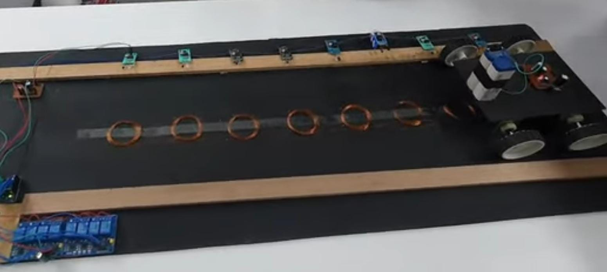

## Wireless EV Charging using Solar Energy 

## 🔧 Project Overview
This is a hardware-based project built during my time at MANIT Bhopal. The goal was to design a system that wirelessly charges electric vehicles using solar power as the energy source.

## 🎯 Problem Solved
- Reduces dependence on wired EV chargers
- Useful in areas with unreliable power supply
- Promotes clean and accessible energy

## 🛠️ Tools & Components
- Solar panels (45W)
- Wireless transmitter/receiver coils
- Power electronics (MOSFETs, relays)
- MATLAB Simulink for design simulation

## 📸 Photos 

## 📈 Outcome
- Functional prototype built
- Learned practical application of clean tech
- Strong teamwork and problem-solving experience

